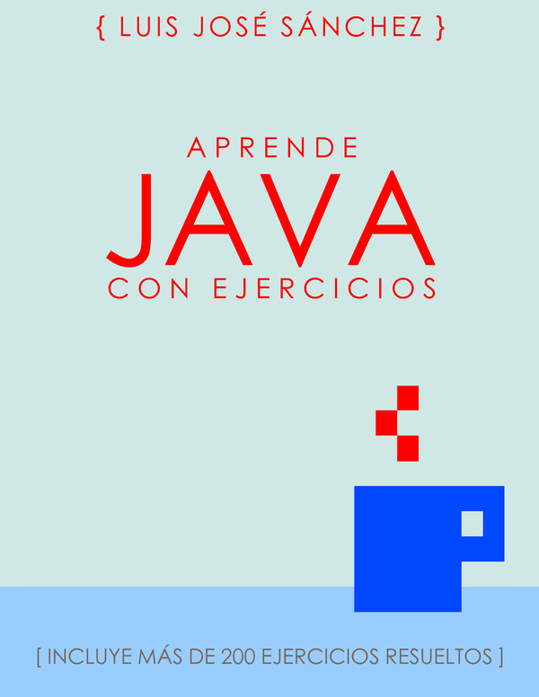

# Ejercicios de programación

✲ Ejercicios de la asignatura **programación** de **1º DAW** (Desarrollo de Aplicaciones Web).

## Ejemplo de un programa en Java

A continuación se muestra el programa "Hola Mundo" en Java.

```java
/**
 * Muestra por pantalla la frase "¡Hola mundo!"
 *
 * @author Beatriz Parejo
 */

public class HolaMundo { // Clase principal
  public static void main(String[] args) {
    System.out.println("¡Hola mundo!");
  }
}
```
Para compilar el programa teclea lo siguiente:

```console
javac HolaMundo.java
```
Se puede ejecutar el programa tecleando lo siguiente:

```console
java HolaMundo.java
```

## Qué se estudia en programación

* Lenguaje de programación Java  :coffee:
* Comandos de Linux  :penguin:
* Git y GitHub  :octocat:

## :blue_book: Bibliografía


[Aprende Java con Ejercicios] (https://leanpub.com/aprendejava)

